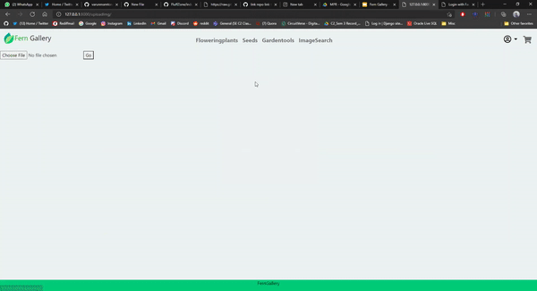

# FernGallery

### Introduction 

- Most of the people being urban dwellers spending their days in apartments with limited access to parks and ecological reserves, have no way of feeling close to nature and experiencing the benefits of being around plants.
- Fern Gallery is an online plants gallery, having numerous flowering plants, seeds and gardening tools which you can buy. Fern Gallery enables a person to search desired flowering plants or seeds from a wide range of variety offered.


### Demo
- Search product by image.
  - 
- Web App demo
  - 
  
### Features
- Users can search for a particular flowering plant by uploading its image and purchase it.
- Cart feature allows the user to easy manage the current purchases.
- Email notification is sent on a sucessfully placed order.

### Tech Stack
- Frontend
	- HTML5
	- CSS3
  - Bootstrap4
- Backend
    - Django framework
- Database
    - SQLite
- Machine Learning
    - tensorflow
    - NumPy
    - Pandas
    - keras

### Local Setup
- Clone repository.
- Setup virtual environment
- Make an empty folder identifImgs
  - `cd FernGallery/fern`
  - `mkdir identifImgs`
```python
pip install -r requirements.txt
python manage.py makemigrations
python manage.py migrate
python manage.py runserver
```
- Go to `127.0.0.1:8000` in your web browser.


### Members 

- Chiraayu Meghnani

<a href="mailto:chiraayupm@gmail.com"></a>
<a href="http://www.linkedin.com/in/chiraayu-pravin"></a>

- Varun Mamtora

<a href="https://twitter.com/MamtoraVarun"></a>
<a href="mailto:varunmamtora@gmail.com"></a>
<a href="https://www.linkedin.com/in/varun-mamtora-0b725b171/"></a>
